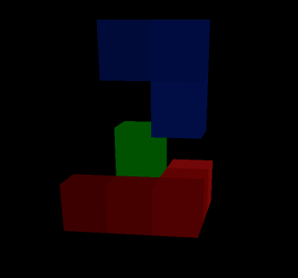

FostomEngine
============

Voxel based game engine written in D2 programming language. Voxel engines became actual when graphics card were able
to excecute generic code (CUDA and OpenCL). At this moment there are some experimental developments: Atomontage Engine,
Gigavoxels, Procedural Worlds. But all of them are closed or unrelased.

This engine based on Gigavoxel technology described in 
[this paper](http://maverick.inria.fr/Publications/2011/Cra11/). The article can be seen as disign document and road map
for the project.

Compilation
===========

Engine uses [dub](http://code.dlang.org/) for building. There are two main build configurations:
Client:
```
dub build --config=client
```
Server:
```
dub build --config=server
```

Dependencies
============
There are some third party libraries that cannot be build through dub. You should douwnload binary distribution or compile them by yourself and then put into bin folder:
* [GLFW3](http://www.glfw.org/docs/latest/)
* [FreeImage](http://freeimage.sourceforge.net/)

Also your system should support at least OpenGL 3.0 and OpenCL 1.2. You can face into some linking problems in GNU/Linux platform, that could be fixed by creating symbolic links for `libOpenCL.so` and other dependencies in `/usr/lib`.

Milestones
===========
* Creating base polygon engine. (DONE)
* Creating wrapper for OpenCL renderer. (DONE)
* Rendering a single voxel. (DONE)
* Rendering voxel brick. (DONE)
* Rendering simple octree. (In progress)
* Rendering complex octree.
* Creating GPU cache system.
* Rendering multiple octrees.
* Creating polygon to octree convertor.

Screenshots
===========

